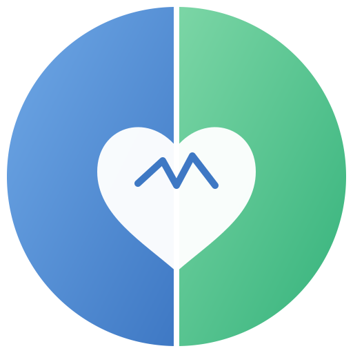

<p align="center">
  
</p>

<h1 align="center">База даних ментального здоров'я</h1>

<p align="center">
  
  
</p>


**База даних ментального здоров'я** — це персональна система для відстеження, структурування та аналізу щоденних активностей і ментального стану користувача за допомогою ШІ-агента.

Автор проєкту — [Андрій БОГДАНОВИЧ](https://www.bogdanovych.org).

---

## 📂 Структура проєкту

Проєкт має таку структуру каталогів та файлів:

```
.
├── AGENTS.md              # Інструкції, схеми та робочі процеси для ШІ-агента
├── .agents/skills/        # Директорія з навичками (skills) агента
├── data/                  # Робоча директорія з реальними даними користувача
│   ├── index.md           # Головний покажчик (індекс) бази даних
│   ├── profile.md         # Особистий профіль користувача та таблиця категорій
│   ├── log.md             # Журнал активності (історія імпортів, звітів тощо)
│   ├── raw/               # Збережені вхідні матеріали
│   └── reports/           # Аналітичні звіти за періоди
├── templates/             # Шаблони для створення нових файлів
├── examples/              # Еталонні приклади заповнення всіх файлів бази даних
└── inbox/                 # Тимчасове сховище для нових необроблених файлів перед імпортом
```

---

## 🚀 Як почати працювати

### 1. Клонування репозиторію
Склонуйте проєкт на свій локальний комп'ютер:
```bash
git clone https://github.com/BogdanovychA/mental-health.git
```

### 2. Налаштування профілю користувача

Оберіть агента, з яким будете працювати. Це можуть бути:
* [Antigravity](https://antigravity.google);
* [Hermes](https://hermes-agent.nousresearch.com);
* [Claude Cowork](https://claude.com/product/cowork);
* [OpenCode](https://opencode.ai) тощо.

> [!NOTE]
> Залежно від обраного агента, необхідно скопіювати (або перейменувати) [AGENTS.md](AGENTS.md) у файл із відповідною назвою, яку цей агент зчитує під час запуску (наприклад, `CLAUDE.md` для Claude), або створити символічне посилання. Уточніть це в документації до вашого агента.

Щоб запустити базу даних, зверніться до обраного ШІ-агента для проведення онбордингу:
- Попросіть агента: **"Привіт, давай налаштуємо мій профіль"**.
- Агент проведе коротке дружнє опитування (ім'я, дата народження, сімейний стан, сфера діяльності, хобі) та узгодить персональні категорії активностей.
- Після цього агент автоматично створить файл вашого профілю у `data/profile.md` та ініціалізує базу даних.

---

## 🧠 Як оцінювати свій ментальний стан

Система базується на щоденній фіксації подій у різних сферах життя та їхньому емоційному оцінюванні:
1. **Категоризація**: Усі активності розподіляються за сферами (наприклад, `Сім'я`, `Робота`, `Спорт`, `Хобі`, `Здоров'я` тощо). Список категорій налаштовується у вашому профілі (`data/profile.md`).
2. **Шкала оцінки**: Кожній події присвоюється бал від `-5` до `+5` (насправді мінімум та максимум не обмежені, але варто дотримуватися цих меж, щоб результати були показовішими) відповідно до її впливу на ваш стан:
   - **Позитивні бали (`+1`..`+5`)**: заняття спортом, відпочинок, приємне спілкування, досягнення на роботі.
   - **Негативні бали (`-1`..`-5`)**: стресові наради, сварки, перевтома, недосипання.
3. **Баланс**: Щоденний та щотижневий баланс (сума всіх балів) допомагає зрозуміти, які сфери життя дають вам ресурс, а які — виснажують.

---

## 📥 Як імпортувати інформацію (Ingest)

Ви можете додавати нові записи про свої активності у два способи:

### Спосіб 1. Через папку inbox/
Створіть текстовий файл у папці [inbox/](inbox/) за шаблоном:
```text
15 липня 2026

Зробила коротку розминку +1
Прогулянка в парку з Омеляном: +3
Сварка / з'ясування стосунків із Зиновієм: -5
Успішно завершила складний етап проєкту: плюс 3
Тривала нарада з керівництвом: мінус 5
```
*Бали можна писати як цифрами (`+3`, `-2`), так і текстом (`плюс 3`, `мінус три`).*

### Спосіб 2. Безпосередньо в чаті
Надішліть ШІ-агенту повідомлення зі списком активностей та балами за день або одразу за кілька днів.

> [!NOTE]
> Агент автоматично розпізнає дати й бали, створить структурований raw-файл у `data/raw/YYYY/MM/`, оновить покажчик `data/index.md` та журнал `data/log.md`. Після імпорту тимчасові файли з `inbox/` автоматично видаляються.

---

## 📊 Як створювати звіти (Report)

Щотижневі звіти допомагають проаналізувати ментальний стан у динаміці. Щоб згенерувати звіт, попросіть ШІ-агента: **"Створи звіт за минулий тиждень"**.

**Що робить ШІ-агент:**
1. **Аналіз**: Досліджує всі raw-файли за звітний період (за замовчуванням повний тиждень: з понеділка по неділю).
2. **Агрегація**: Розраховує баланс балів для кожної категорії активностей.
3. **Аналітика**: Формує опис емоційного стану, виявляє взаємозв'язки між сферами життя і настроєм та пропонує рекомендації.
4. **Оновлення**: Зберігає звіт у `data/reports/YYYY/MM/` та оновлює покажчик `data/index.md` і журнал `data/log.md`.

---

## 🔍 Як перевіряти цілісність бази (Lint)

Щоб уникнути помилок, битих посилань чи розбіжностей у балах, базу даних слід періодично перевіряти. Для цього попросіть агента: **"Перевір цілісність бази даних"**.

**ШІ-агент запустить лінтер, який:**
1. Перевірить цілісність структури (наявність недійсних посилань чи осиротілих файлів, які не додано до покажчика).
2. Перевірить правильність підсумовування добових та тижневих балів.
3. Виявить часові прогалини (тижні без звітів).
4. Автоматично виправить технічні помилки та внесе результати перевірки до журналу `data/log.md`.

---

## 🖥️ Перегляд бази

Для перегляду та зручної навігації ви можете використовувати будь-який редактор Markdown. Рекомендуються застосунки на кшталт [Obsidian](https://obsidian.md), які дозволяють візуалізувати зв'язки між сторінками у вигляді графа та спрощують перехід за відносними посиланнями.
